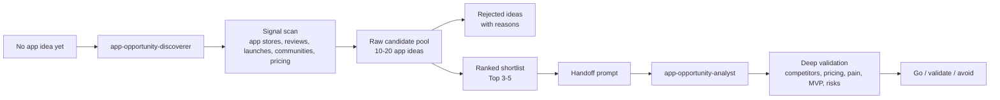

# App Opportunity Analyst

[中文版](README.zh-CN.md)

**Discover what to build. Validate before you build.**

An open-source AI workflow pack for finding profitable app ideas from real market signals, not random brainstorming.


App Opportunity Analyst is an open-source two-skill workflow pack for indie developers who do not know what app to build next. It helps an AI coding assistant first discover app ideas from market signals, then deeply analyze and validate the strongest opportunities.

The workflow has two skills:

- `app-opportunity-discoverer`: start from zero, scan market signals, generate a candidate pool, reject weak ideas, and shortlist the best ideas.
- `app-opportunity-analyst`: take a specific idea, category, or shortlist item and deeply analyze competitors, pricing, demand, risks, MVP scope, and go/no-go.

## Workflow



## What It Does

- Proactively discovers app ideas even when you do not know what direction to explore.
- Hands the best ideas into a deeper analysis and validation workflow.
- Finds app opportunities inside a category, audience, platform, or trend.
- Analyzes App Store, Google Play, competitor websites, reviews, pricing, Product Hunt, Reddit, Hacker News, GitHub, and other public signals.
- Extracts repeated user pain from reviews and discussions.
- Scores ideas by demand, willingness to pay, competition gap, build feasibility, distribution, retention, and indie fit.
- Produces a practical MVP brief and 7-day validation plan.

## Quick Start

1. Install both skills:

```bash
mkdir -p ~/.codex/skills
cp -R skills/app-opportunity-discoverer ~/.codex/skills/
cp -R skills/app-opportunity-analyst ~/.codex/skills/
```

2. Start from zero:

```text
Use app-opportunity-discoverer to discover app ideas for me from scratch.
Constraints: solo developer, SwiftUI or Next.js, 2-week MVP, low budget, no marketplace ideas.
```

3. Deeply validate the top idea:

```text
Use app-opportunity-analyst to deeply validate the top idea from the discovery report.
Include competitors, pricing, review pain, MVP scope, risks, and a go/validate/avoid recommendation.
```


## Who It Is For

- Solo developers looking for a 1-2 week MVP idea.
- Indie hackers choosing between app categories.
- Builders using Codex, Claude Code, Cursor, or another agentic coding tool.
- Developers who want market evidence before opening their editor.

## Example Prompts

```text
Use app-opportunity-discoverer to discover app ideas for me from scratch.
```

```text
Use app-opportunity-discoverer to find app opportunities in AI journaling for solo iOS developers, then use app-opportunity-analyst to analyze the top idea.
```

```text
Use app-opportunity-analyst to analyze whether PDF scanner apps are still worth entering.
```

```text
Use app-opportunity-analyst to validate this idea: a calendar app that turns messy voice notes into scheduled tasks.
```

## Repository Structure

```text
app-opportunity-analyst/
├── skills/
│   ├── app-opportunity-discoverer/
│   │   ├── SKILL.md
│   │   ├── references/
│   │   │   ├── discovery-method.md
│   │   │   └── discovery-scorecard.md
│   │   └── templates/
│   │       └── idea-discovery-report.md
│   └── app-opportunity-analyst/
│       ├── SKILL.md
│       ├── references/
│       │   ├── data-sources.md
│       │   ├── report-methodology.md
│       │   └── scoring-rubric.md
│       └── templates/
│           ├── app-mvp-brief.md
│           ├── opportunity-report.md
│           └── validation-report.md
├── commands/
│   ├── analyze-category.md
│   ├── discover-ideas.md
│   ├── find-opportunities.md
│   └── validate-idea.md
├── examples/
│   ├── ai-journal-app-report.md
│   ├── from-scratch-discovery-sample.md
│   ├── from-scratch-discovery-sample.zh-CN.md
│   ├── habit-tracker-report.md
│   ├── pdf-scanner-report.md
│   ├── sourced-ai-voice-notes-report.md
│   ├── sourced-ai-voice-notes-report.zh-CN.md
│   ├── sourced-calorie-macro-tracker-report.md
│   ├── sourced-calorie-macro-tracker-report.zh-CN.md
│   ├── sourced-plant-care-report.md
│   └── sourced-plant-care-report.zh-CN.md
└── ROADMAP.md
```

## Example Reports

- `examples/from-scratch-discovery-sample.md`: example of proactively discovering ideas when the builder has no direction yet.
- `examples/sourced-ai-voice-notes-report.md`: sourced analysis of AI voice notes and personal memory apps.
- `examples/sourced-plant-care-report.md`: sourced analysis of plant care and toxicity companion apps.
- `examples/sourced-calorie-macro-tracker-report.md`: sourced analysis of calorie and macro tracker opportunities.
- `examples/*.zh-CN.md`: Chinese versions of the sourced example reports.
- `examples/ai-journal-app-report.md`: lightweight unsourced example.
- `examples/pdf-scanner-report.md`: lightweight unsourced example.
- `examples/habit-tracker-report.md`: lightweight unsourced example.

## Install

Copy both skills into your local skills directory.

For Codex:

```bash
mkdir -p ~/.codex/skills
cp -R skills/app-opportunity-discoverer ~/.codex/skills/
cp -R skills/app-opportunity-analyst ~/.codex/skills/
```

For other agent tools, copy the skill folder or paste the relevant command file into your workflow.

## Commands

The command files are plain Markdown so they can be adapted to different agent tools:

- `commands/discover-ideas.md`: use `app-opportunity-discoverer` to proactively discover ideas from scratch.
- `commands/find-opportunities.md`: use discoverer first, then analyst for the top candidate.
- `commands/analyze-category.md`: use `app-opportunity-analyst` to decide whether an app category is worth entering.
- `commands/validate-idea.md`: use `app-opportunity-analyst` to validate a specific app idea before building.

## What This Is Not

- Not a magic startup idea generator.
- Not a substitute for real user interviews.
- Not a source of guaranteed revenue estimates.
- Not limited to AI apps, although it works well for AI-enabled app categories.

## Product Direction

The open-source skill is the first layer. A future hosted product could add continuous monitoring, saved reports, app store data connectors, review mining, trend history, and weekly opportunity alerts.

## License

MIT
