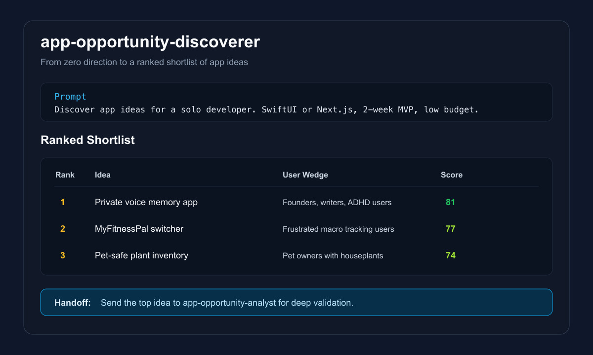
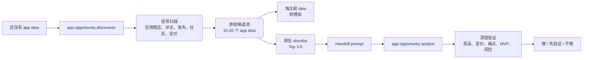
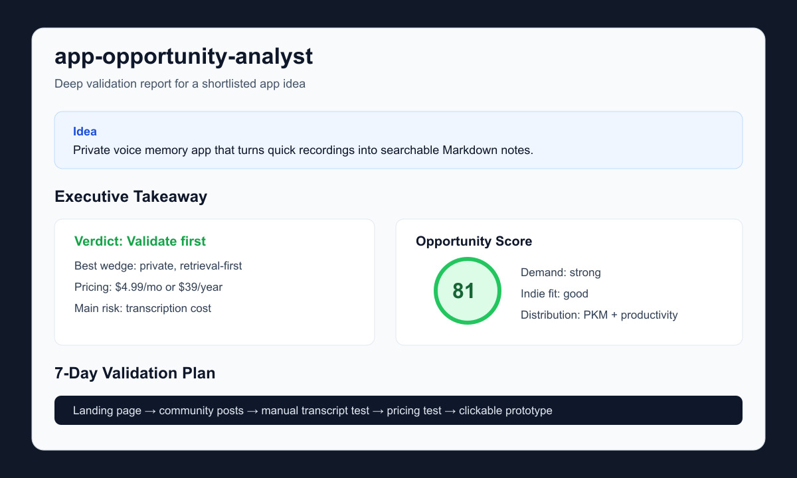

# App Opportunity Analyst

[English](README.md)

**先发现要做什么，再验证值不值得做。**

一个开源 AI 工作流包：从真实市场信号中发现更可能赚钱的 app 机会，而不是随机头脑风暴。



App Opportunity Analyst 是一个开源的双 Skill 工作流包，面向不知道下一个 app 该做什么的独立开发者。它可以帮助 AI 编程助手先从市场信号里主动发现 app idea，再对最有机会的方向做深度分析和验证。

这个工作流包含两个 skill：

- `app-opportunity-discoverer`：从零开始，扫描市场信号，生成候选池，淘汰弱 idea，筛选最值得分析的方向。
- `app-opportunity-analyst`：接收一个具体 idea、品类或 shortlist item，深度分析竞品、定价、需求、风险、MVP 范围和 go/no-go。

## 工作流



## 它能做什么

- 在你完全不知道做什么时，主动扫描信号并筛选 app idea。
- 将最强 idea 交给深度分析和验证工作流。
- 根据品类、用户、平台或趋势发现 app 机会。
- 分析 App Store、Google Play、竞品官网、用户评论、价格、Product Hunt、Reddit、Hacker News、GitHub 等公开信号。
- 从评论和社区讨论里提取重复出现的用户痛点。
- 从需求、付费意愿、竞争缺口、开发难度、获客难度、留存潜力、独立开发者适配度等维度给机会打分。
- 输出可执行的 MVP Brief 和 7 天验证计划。

## 快速开始

1. 安装两个 skill：

```bash
mkdir -p ~/.codex/skills
cp -R skills/app-opportunity-discoverer ~/.codex/skills/
cp -R skills/app-opportunity-analyst ~/.codex/skills/
```

2. 从零开始发现 idea：

```text
使用 app-opportunity-discoverer，从零开始帮我发现一些值得做的 app idea。
限制：独立开发者，SwiftUI 或 Next.js，2 周 MVP，低预算，不做 marketplace。
```

3. 深度验证排名第一的 idea：

```text
使用 app-opportunity-analyst 深度验证 discovery report 里排名第一的 idea。
包含竞品、定价、评论痛点、MVP 范围、风险，以及做/先验证/不做建议。
```



## 适合谁

- 想找 1-2 周 MVP 方向的独立开发者。
- 正在比较不同 app 品类的 indie hacker。
- 使用 Codex、Claude Code、Cursor 或其他 agentic coding 工具的开发者。
- 希望先看市场证据，再开始写代码的人。

## 示例 Prompt

```text
使用 app-opportunity-discoverer，从零开始帮我发现一些值得做的 app idea。
```

```text
使用 app-opportunity-discoverer，帮我发现 AI journaling 方向里适合 solo iOS 开发者的机会，然后用 app-opportunity-analyst 分析排名第一的 idea。
```

```text
使用 app-opportunity-analyst，分析 PDF scanner app 这个品类现在还值不值得进入。
```

```text
使用 app-opportunity-analyst，验证这个想法：一个可以把混乱语音笔记自动转成日程任务的 calendar app。
```

## 仓库结构

```text
app-opportunity-analyst/
├── skills/
│   ├── app-opportunity-discoverer/
│   │   ├── SKILL.md
│   │   ├── references/
│   │   │   ├── discovery-method.md
│   │   │   └── discovery-scorecard.md
│   │   └── templates/
│   │       └── idea-discovery-report.md
│   └── app-opportunity-analyst/
│       ├── SKILL.md
│       ├── references/
│       │   ├── data-sources.md
│       │   ├── report-methodology.md
│       │   └── scoring-rubric.md
│       └── templates/
│           ├── app-mvp-brief.md
│           ├── opportunity-report.md
│           └── validation-report.md
├── commands/
│   ├── analyze-category.md
│   ├── discover-ideas.md
│   ├── find-opportunities.md
│   └── validate-idea.md
├── examples/
│   ├── ai-journal-app-report.md
│   ├── from-scratch-discovery-sample.md
│   ├── from-scratch-discovery-sample.zh-CN.md
│   ├── habit-tracker-report.md
│   ├── pdf-scanner-report.md
│   ├── sourced-ai-voice-notes-report.md
│   ├── sourced-ai-voice-notes-report.zh-CN.md
│   ├── sourced-calorie-macro-tracker-report.md
│   ├── sourced-calorie-macro-tracker-report.zh-CN.md
│   ├── sourced-plant-care-report.md
│   └── sourced-plant-care-report.zh-CN.md
└── ROADMAP.md
```

## 样例报告

- `examples/from-scratch-discovery-sample.md`：当开发者完全没有方向时，主动发现 idea 的英文样例。
- `examples/from-scratch-discovery-sample.zh-CN.md`：上面报告的中文版。
- `examples/sourced-ai-voice-notes-report.md`：带来源的 AI voice notes / personal memory app 分析。
- `examples/sourced-ai-voice-notes-report.zh-CN.md`：上面报告的中文版。
- `examples/sourced-plant-care-report.md`：带来源的 plant care / toxicity companion app 分析。
- `examples/sourced-plant-care-report.zh-CN.md`：上面报告的中文版。
- `examples/sourced-calorie-macro-tracker-report.md`：带来源的 calorie / macro tracker app 分析。
- `examples/sourced-calorie-macro-tracker-report.zh-CN.md`：上面报告的中文版。
- `examples/ai-journal-app-report.md`：轻量无来源样例。
- `examples/pdf-scanner-report.md`：轻量无来源样例。
- `examples/habit-tracker-report.md`：轻量无来源样例。

## 安装

把两个 skill 都复制到你的本地 skills 目录。

Codex:

```bash
mkdir -p ~/.codex/skills
cp -R skills/app-opportunity-discoverer ~/.codex/skills/
cp -R skills/app-opportunity-analyst ~/.codex/skills/
```

其他 AI Agent 工具可以直接复制 skill 文件夹，或者把 `commands/` 里的 Markdown 指令放进自己的工作流。

## 命令

这些命令文件是普通 Markdown，方便迁移到不同 Agent 工具：

- `commands/discover-ideas.md`：使用 `app-opportunity-discoverer`，在你不知道做什么时从零主动发现并筛选 app idea。
- `commands/find-opportunities.md`：先用 discoverer 找机会，再用 analyst 分析排名靠前的候选。
- `commands/analyze-category.md`：使用 `app-opportunity-analyst` 判断某个 app 品类是否值得进入。
- `commands/validate-idea.md`：使用 `app-opportunity-analyst` 在开发前验证一个具体 app 想法。

## 评分维度

每个机会会从这些维度综合判断：

- 需求信号
- 付费意愿
- 竞争缺口
- 开发可行性
- 获客可行性
- 留存潜力
- 独立开发者适配度

详细规则见 `skills/app-opportunity-analyst/references/scoring-rubric.md`。

## 它不是什么

- 不是魔法创业点子生成器。
- 不能替代真实用户访谈。
- 不保证收入预测准确。
- 不只适用于 AI app，但很适合分析 AI-enabled app 品类。

## 产品方向

开源 skill 是第一层。未来可以在它之上做 hosted web product：

- 持续监控 app 机会
- 保存历史报告
- 接入 App Store / Google Play 数据
- 自动挖掘评论痛点
- 追踪趋势变化
- 每周发送机会报告

## License

MIT
